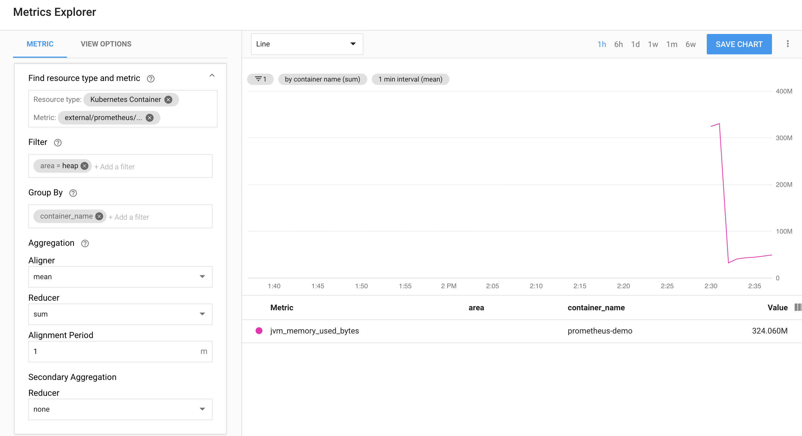

```bash
curl -sSO "https://storage.googleapis.com/stackdriver-prometheus-documentation/rbac-setup.yml"
kubectl apply -f rbac-setup.yml --as=admin --as-group=system:masters
curl -sSO "https://storage.googleapis.com/stackdriver-prometheus-documentation/prometheus-service.yml"
#Edit _stackdriver_project_id: [PROJECT_ID]
#Edit _kubernetes_cluster_name: [CLUSTER_NAME]
#Edit _kubernetes_location: [CLUSTER_LOCATION]
kubectl apply -f prometheus-service.yml 
kubectl apply -f spring-dpl.yaml
```


#### References
[1] https://cloud.google.com/monitoring/kubernetes-engine/prometheus
